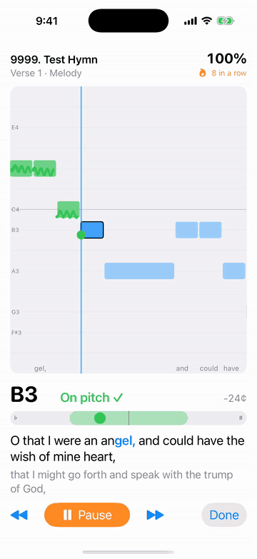
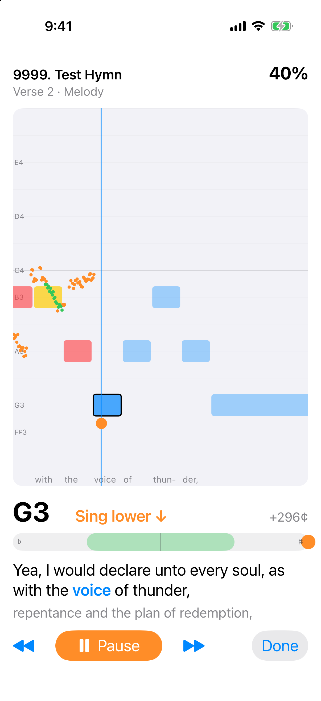
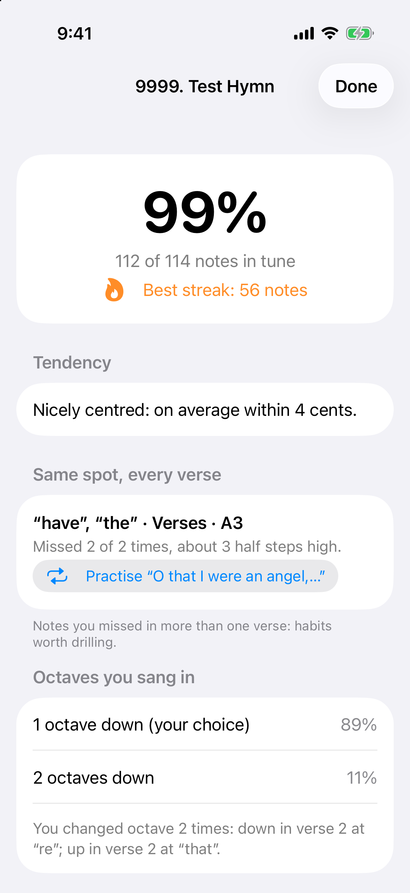
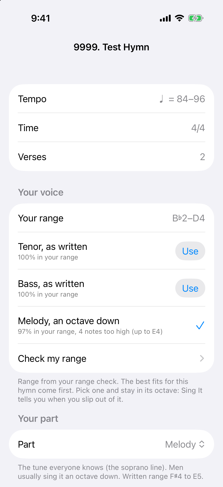
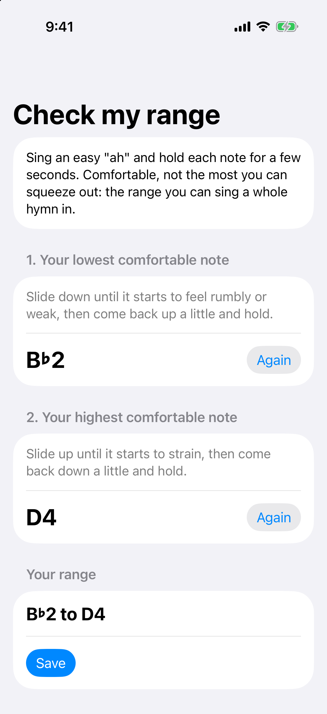

# Sing It

[](https://github.com/ianneub/sing-it/actions/workflows/tests.yml)

An iPhone app that helps you sing hymns better. Pick a hymn and your part, and sing: Sing It
shows the words and notes, listens through your AirPods or the phone's microphone, and shows
in real time how close you are to your note, whether you're sharp or flat, and your score.

<p align="center">
  
</p>

It's built for congregational hymn singing: it follows where you are in the hymn from your
own voice (so it works while the organ and congregation are going), and in practice mode it
plays the hymn's accompaniment and knows exactly where you are.

This is a personal, non-commercial project. It is **not affiliated with or endorsed by The
Church of Jesus Christ of Latter-day Saints**. It works with hymn files you download
yourself from the Church's website; none are included here (see [Hymn files](#hymn-files)).

<p align="center">
  
  
  
  
</p>

<p align="center"><sub>Singing, the summary, part suggestions for your voice, and the range check. Shown with a
made-up test hymn (an original tune set to Alma 29:1–2), not a hymn from the hymnbook.</sub></p>

## Features

- **Parts:** soprano, alto, tenor, bass, the melody (sung in any octave), "any part" (any
  note of the chord counts), or Auto, which works out which part you're singing.
- **Live feedback:** scrolling notes with your pitch drawn over them, a tuning meter with
  "sing higher / lower", the words with the current syllable highlighted, and a running score.
- **Following:** tracks your place from your singing, tolerant of singing off-key or an
  octave or two down; tap a line of words to re-sync.
- **Practice mode:** plays the Church's accompaniment recording and scores you against it.
  It can also play just your part, or your part over the accompaniment, so you hear what to
  sing. Timing allows for Bluetooth delay and for how far behind the music you sing.
- **Coaching:** a summary after each hymn, notes you miss in the same place every verse
  with a button to loop that line, which octave you sang in and where you switched, and
  your vocal range with suggestions for the part and octave that fit your voice.
- **Recordings** of every session, to listen back.

## How it works

Hymn PDFs from the Church's music site are vector engravings, so `tools/hymnpdf` reads the
exact position of every notehead, stem, beam and syllable (no OCR) and turns each hymn into
JSON: all four parts, every verse's lyrics, the order verses and choruses are sung, and the
organ introduction. `tools/beatmap.py` aligns an accompaniment recording to those notes so
practice mode knows which beat is playing at every moment.

The app's logic (pitch detection, following, scoring) is the Swift package
`ios/Packages/SingItCore`, which builds and tests on Linux or macOS. The iPhone app in
`ios/SingIt` is SwiftUI and AVFoundation, generated as an Xcode project with XcodeGen.

```
tools/hymnpdf/      PDF → hymn JSON converter (Python)
tools/beatmap.py    aligns an accompaniment MP3 to a hymn (practice mode)
tools/tests/        converter tests
ios/project.yml     XcodeGen spec for the app
ios/SingIt/         the iPhone app
ios/Packages/SingItCore/   the app's logic and its tests
hymns/              your hymn files (not committed): pdf/, json/, beatmaps/, audio/
```

`CLAUDE.md` has detailed notes on the design and the engraving rules the converter follows.

## Hymn files

The hymns, their PDFs and the accompaniment recordings are copyrighted by Intellectual
Reserve, Inc. and other owners. The Church allows them to be used for noncommercial home
and church purposes; publishing them needs its permission. So this repository contains no
hymn files, and nothing derived from them. **Don't commit or share them.** Get them for your
own use:

1. On the Church's music site (churchofjesuschrist.org › Music › Hymns), open a hymn and
   download its sheet music PDF. Save it as `hymns/pdf/NNNN-slug.pdf`, where `NNNN` is the
   hymn number with leading zeros and `slug` is the last part of the hymn page's address,
   e.g. `hymns/pdf/0002-the-spirit-of-god.pdf`.
2. For practice mode, also download the hymn's **accompaniment** recording (instrumental,
   no voices) as `hymns/audio/NNNN-slug.accompaniment.mp3`, and note the address it came
   from: the app downloads it again on the phone.
3. Convert them:

   ```bash
   python3 -m venv .venv && .venv/bin/pip install -r tools/requirements.txt   # once; beatmap also needs ffmpeg

   PYTHONPATH=tools .venv/bin/python -m hymnpdf hymns/pdf/0002-the-spirit-of-god.pdf \
       -o hymns/json/0002-the-spirit-of-god.json --strict
   .venv/bin/python tools/beatmap.py hymns/json/0002-the-spirit-of-god.json \
       hymns/audio/0002-the-spirit-of-god.accompaniment.mp3 \
       --url <the recording's address> -o hymns/beatmaps/0002-the-spirit-of-god.json
   ```

   `--strict` fails on any warning. If you made beat maps with an older `beatmap.py`, run
   it again: older maps started each verse up to 2 s before the music did, and ran notes on
   through the organist's breaths. The converter has been checked against a development
   set of 20 hymns from the 1985 hymnbook; others may need fixes (`--dump` and `--overlay`
   help). Every hymn in `hymns/json` is built into the app.

## Building the app

You need a Mac with Xcode (iOS 17 or later on the phone) and [XcodeGen](https://github.com/yonaskolb/XcodeGen).

1. `brew install xcodegen`
2. Create `ios/project.local.yml` with your own signing team and a unique bundle ID (this
   file isn't committed):

   ```yaml
   include:
     - project.yml
   targets:
     SingIt:
       settings:
         base:
           PRODUCT_BUNDLE_IDENTIFIER: com.yourname.singit
           DEVELOPMENT_TEAM: YOURTEAMID   # or leave it out and pick a team in Xcode
   ```

3. `cd ios && xcodegen generate --spec project.local.yml && open SingIt.xcodeproj`, choose your
   iPhone and press Run. The phone needs Developer Mode on (Settings › Privacy & Security).
   With a free Apple account, the app has to be reinstalled every 7 days.

To build on a Mac from a Linux machine over SSH, put `SINGIT_MAC=<ssh host>` in
`ios/local.env` and use `ios/scripts/mac.sh build`, `device` (build and install on the
phone plugged into the Mac) or `test`.

## Screenshots and icon

`ios/scripts/screenshots.sh` (on a Mac; from Linux, `ios/scripts/mac.sh ssh scripts/screenshots.sh`)
retakes the screenshots in the simulator and records the demo video, which becomes the GIF
above with `ffmpeg -ss 0.5 -i demo.mp4 -vf "fps=12,scale=360:-1:flags=lanczos,split[s0][s1];[s0]palettegen=max_colors=96:stats_mode=diff[p];[s1][p]paletteuse=dither=none:diff_mode=rectangle" docs/demo.gif`.
It uses a debug-only screenshot mode that opens
each screen with the made-up test hymn and a simulated singer. `tools/make_icon.py` draws the
app icon.

## Tests

```bash
.venv/bin/pytest                                     # converter tests
cd ios/Packages/SingItCore && swift test             # app logic (macOS, or Linux with Swift)
# On Linux without a working Swift install, use Docker:
docker run --rm --user "$(id -u):$(id -g)" -e HOME=/tmp -v "$PWD":/src \
    -w /src/ios/Packages/SingItCore swift:6.3 swift test
```

GitHub Actions (`.github/workflows/tests.yml`) runs both on every push, and builds the
iPhone app (unsigned) on `main`. Tests that need hymn files skip when they're missing. The rest run on a made-up test hymn
(`ios/Packages/SingItCore/Tests/SingItCoreTests/Fixtures`: an original tune set to Alma 29:1–2
from the Book of Mormon, whose 1830 text is public domain) and on simulated singers.

## License

Sing It is released under the [MIT License](LICENSE).

The converter tools use third-party Python packages under their own licenses:
[PyMuPDF](https://pymupdf.readthedocs.io) (AGPL-3.0), [cmudict](https://pypi.org/project/cmudict/)
(GPL-3.0 package; the CMU Pronouncing Dictionary data is BSD), [Pyphen](https://pypi.org/project/pyphen/)
(GPL/LGPL/MPL), NumPy (BSD) and pytest (MIT). They're installed separately and aren't part
of this repository. The iPhone app uses no third-party code.
